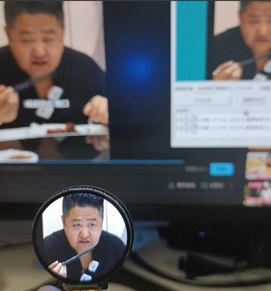
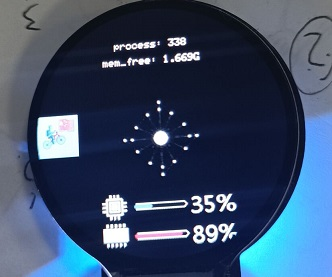

# 介绍

使用乐鑫Esp32模组 ，整合(copy)了其他 up 的设计，设计的桌面小摆件玩具。

主要的三个功能：

- [时钟功能](https://www.bilibili.com/video/BV1vB4y1r7YC?zw)
	

- [无线投屏](https://gitee.com/superddg123/esp32-TFT?_from=gitee_search)

- [显示pc主机性能占用](https://github.com/ShaderFallback/CpuRamGet)

具体使用可以看看这篇[博客]()。

